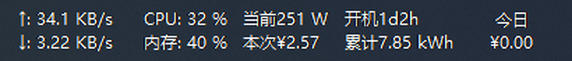
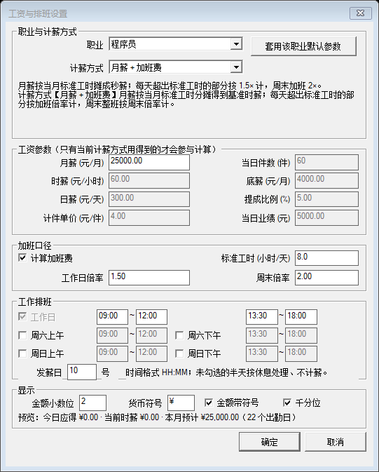
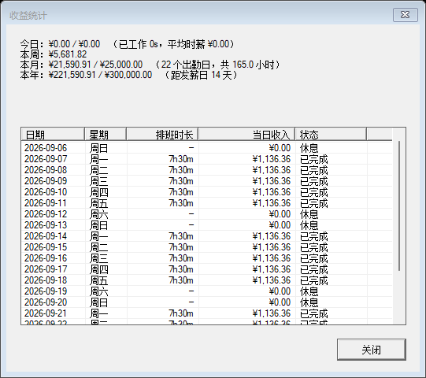

<div align="center">


# SalaryMonitor · 工资监测

**TrafficMonitor 插件：把「今天已经赚了多少钱」实时挂在任务栏上，一秒一秒往上跳。**

支持 20 种职业预设 × 6 种计薪方式，按排班、午休、加班倍率精确到秒。

[**中文**](README.md) · [English](README.en.md)

</div>

---

## 它解决什么问题

上班族对"今天赚了多少"是没有实感的：月薪是一串数字，要到发薪日才落地。
SalaryMonitor 把这个过程变成**可见的、正在增长的数**：

```
今日  ¥412.36
应得  ¥1,136.36
时薪  ¥143.68
进度  ████████░░░░ 36.2%
```

它按你所在职业的真实计薪口径逐秒累计 —— 午休时数字停住，进入加班时段数字加速跳，
下班后冻结，周末班的钱按周末倍率算。不是估算，也不是励志话术，是真算法。

## 界面

**任务栏实际效果**（与 CPU / 内存 / 网速等项并列，最右侧是 SalaryMonitor）：



> 真实任务栏截图。截图时为中国时间周六 00:19，所选职业「教师」为双休，
> 因此「今日」显示 `¥0.00` —— **休息日本来就不计薪**，这是正确行为。

**工资与排班设置**（底部实时试算，改任何参数立刻重算）：



**收益统计**（今日 / 本周 / 本月 / 本年 + 逐日明细）：



## 安装

1. 下载 `SalaryMonitor-x64.zip`，解压得到 `SalaryMonitor.dll`。
2. 把 `SalaryMonitor.dll` 放进 **TrafficMonitor 程序目录下的 `plugins\` 文件夹**
   （没有该文件夹就自己建一个）。
3. 重启 TrafficMonitor → 右键任务栏窗口 → **显示设置** → 勾选 `SalaryMonitor` 的显示项。

配置文件会写在 `%APPDATA%\TrafficMonitor\plugins\SalaryMonitor_config.json`，
卸载插件时删掉该文件即可彻底清除设置。

> 需要 TrafficMonitor 1.84 及以上（插件接口版本 ≥ 7），x64 版本。

## 三步开始用

| 步骤 | 操作 |
|---|---|
| 1 | 右键任务栏窗口 → 插件命令 → **工资与排班设置…** |
| 2 | 在「职业」里选你的职业（比如**程序员**），参数与排班会自动填好 |
| 3 | 确认月薪、上下班时间无误 → 确定 |

设置窗口底部有一行**实时试算**，改任何参数都会立刻显示"今日应得 / 当前时薪 / 本月预计"，
不用保存就能看出效果。

## 显示项（可任选，勾几个放任务栏都行）

| 项目 | 说明 | 示例 |
|---|---|---|
| 今日已赚 | 从今天 0 点到现在累计 | `¥412.36` |
| 今日应得 | 今天一整天（含计划的加班）应得 | `¥1,136.36` |
| 当前时薪 | 此刻的进账速度折算成时薪；午休/下班为 0 | `¥143.68` |
| 今日工时进度 | 已计薪工时 ÷ 当天排班时长 | `36.2%` |
| 今日到账进度 | 已赚 ÷ 今日应得 | `36.2%` |
| 今日进度条 | **自绘进度条**（带百分比文字） | `████░░ 36%` |
| 今日已工作时长 | 不含午休等空档 | `2h42m` |
| 距下班 | 距当天最后一个班次结束 | `4h18m` |
| 今日加班时长 | 超出标准工时的部分 | `1h30m` |
| 出勤状态 | 未上班 / 工作中 / 休息中 / 已下班 / 休息日 | `工作中` |
| 每小时进账 | 当前速率 × 3600 | `¥143.68` |
| 每分钟进账 | 当前速率 × 60 | `¥2.3946` |
| 每秒进账 | 当前速率（元/秒） | `¥0.0399` |
| 本月已赚 | 本月 1 号 ~ 现在 | `¥16,842.10` |
| 本月应得 | 本月整月预计（含周末班与加班） | `¥25,000.00` |
| 本月进度 | 本月已赚 ÷ 本月应得 | `67.4%` |
| 本年已赚 | 1 月 1 日 ~ 现在 | `¥188,420.55` |
| 距发薪日 | 距下一个发薪日 | `12 天` |
| 当前职业 | 当前选中的职业预设 | `程序员` |
| 计薪方式 | 当前使用的计薪口径 | `月薪 + 加班费` |

鼠标悬停在任务栏的插件区域，会显示一份完整明细（职业、计薪方式、今日/本月/状态）。

## 职业预设（20 种）

选中即套用该职业的默认计薪方式、默认金额与默认排班，之后**每一项都还能手改**。

| 职业 | 计薪方式 | 默认参数 | 默认排班 |
|---|---|---|---|
| 程序员 | 月薪 + 加班费 | 20000 | 09:30-12:00 / 13:30-18:30 · 双休 |
| 程序员（995/996） | 月薪 + 加班费 | 25000 | 09:30-12:00 / 13:30-21:00 · 周六全天 |
| 教师 | 月薪固定 | 9000 | 07:50-11:50 / 14:00-17:30 · 双休 |
| 公务员 / 事业单位 | 月薪固定 | 8000 | 09:00-12:00 / 13:30-17:30 · 双休 |
| 医生 / 护士 | 月薪 + 加班费 | 15000 | 08:00-12:00 / 14:00-17:30 · 周六全天 |
| 会计 / 财务 | 月薪固定 | 9000 | 09:00-12:00 / 13:30-17:30 · 双休 |
| 银行柜员 | 月薪固定 | 10000 | 08:30-12:00 / 13:30-17:30 · 双休 |
| 客服 / 文员 | 月薪固定 | 6000 | 09:00-12:00 / 13:30-18:00 · 双休 |
| 销售 | 底薪 + 提成 | 底薪 4000 + 5% × 日业绩 5000 | 09:00-12:00 / 13:30-18:00 · 周六全天 |
| 理发师 / 美甲师 | 底薪 + 提成 | 底薪 3000 + 30% × 日业绩 800 | 10:00-14:00 / 15:00-21:00 · 全年 |
| 外卖骑手 | 计件 | 4 元/单 × 60 单 | 10:00-14:00 / 17:00-21:00 · 全年 |
| 快递员 | 计件 | 1.5 元/件 × 200 件 | 07:30-12:00 / 13:30-18:30 · 周六全天 |
| 工厂计件 | 计件 | 1.2 元/件 × 300 件 | 08:00-12:00 / 13:00-17:30 · 周六全天 |
| 网约车 / 货车司机 | 时薪 | 45 元/时 | 07:00-11:00 / 16:00-21:00 · 全年 |
| 家教 / 兼职 | 时薪 | 80 元/时 | 18:00-20:00 · 双休 |
| 律师 | 时薪 | 800 元/时 | 09:00-12:00 / 13:30-18:00 · 双休 |
| 主播 / 自媒体 | 时薪 | 150 元/时 | 20:00-23:00 · 全年 |
| 建筑 / 日结工 | 日薪 | 350 元/天 | 07:00-11:30 / 13:30-18:00 · 全年 |
| 自由职业 | 日薪 | 500 元/天 | 09:00-12:00 / 14:00-18:00 · 全年 |
| 自定义 | 自选 | 保留你当前填的一切 | 自行设置 |

> 没有你的职业？选最接近的，然后把参数改成自己的；或者选「自定义」从零填。

## 六种计薪方式（算式）

设 **R** = 当前秒薪（元/秒），**今日已赚 = ∫₀^现在 R dt**（按分段积分，所以午休不会被计入）。

| 方式 | 当前秒薪 R | 说明 |
|---|---|---|
| **月薪固定** | 月薪 ÷ 当月排班总秒数 | 班内匀速进账；周末班按正常价。整月应得 = 月薪 |
| **月薪 + 加班费** | 开加班费：月薪 ÷ 当月**标准工时**秒数<br>关加班费：月薪 ÷ 当月排班总秒数 | 超出标准工时的部分 ×工作日倍率；周末整班 ×周末倍率。所以连月薪都随加班浮动 |
| **时薪** | 时薪 ÷ 3600 | 只算班内时间；开启加班费后超标准工时同样乘倍率 |
| **日薪** | 日薪 ÷ 当天排班秒数 | 加班超过标准工时的部分另乘倍率，所以加班狠的那天会**超过日薪** |
| **计件** | (件单价 × 当日件数) ÷ 当天排班秒数 | 计件与工时无关，按当天班次匀速摊平（相当于"当日收入 ÷ 当日时长"的实时版） |
| **底薪 + 提成** | (底薪 ÷ 当月出勤天数 + 当日业绩 × 提成比例) ÷ 当天排班秒数 | 底薪按月出勤天数摊到每天，提成按当日业绩实时摊平 |

**加班判定**：每天按班次先后累计，前「标准工时」（默认 8 小时）为标准时段；
多出来的部分算加班，按「工作日倍率」（默认 1.5）计；**周末整天按「周末倍率」（默认 2）计**。
月薪固定制与计件/提成不与工时挂钩，因此没有加班加成。

**午休与下班**：上午、下午是两段独立区间，中间空档（例如 12:00-13:30）不计薪，
状态显示「休息中」，速率归 0；过了当天最后一个班次结束时刻，金额冻结。

**本月/本年**：由排班模型推导 —— 过去的日子按当天排班应得全额计入，
今天用实时累计，所以任何时候都和"整月应得"对得上，重启电脑也不会丢状态。

## 右键菜单

| 命令 | 作用 |
|---|---|
| 工资与排班设置… | 打开设置窗口（同一个窗口） |
| 切换职业（下一个） | 快速在 20 个职业预设间轮换，适合"想看看别的职业能赚多少" |
| 收益统计… | 今日 / 本周 / 本月 / 本年汇总 + 最近三周逐日明细 |
| 关于… | 版本、作者、算法说明 |
| 项目主页（GitHub）… | 打开仓库 |

## 常见问题

**数字一直不动？**
先看「出勤状态」。显示 `未上班 / 休息中 / 已下班 / 休息日` 时是不计薪的 —— 这是设计如此。
再检查排班时段与当前系统时间是否对得上。

**加班费没算进去？**
① 看「加班口径」里的**标准工时**：如果当天排班本身不超过标准工时，就没有加班时段；
② 如果实际加班而排班没写那么晚，请把下班时间改到实际时间（排班结束前不会计薪）。

**月薪制的每月 "日单价" 为什么不一样？**
月薪是摊到**当月实际出勤天数**上的，2 月与 3 月的天数不同，单日应得自然不同 —— 这是真实口径。

**计件 / 提成怎么填？**
填「当日件数」或「当日业绩」，插件就按当天排班把这些钱匀速摊到每一秒。
换了数据（比如今天跑了 80 单）直接改数值即可。

**寒暑假 / 整月休假怎么处理？**
把该月排班里的四段全部取消勾选，保存时会提示"本月工时为 0"并确认一次；确认后收入显示为 0。

**我的职业没有？**
挑一个最接近的改参数，或者选「自定义」从头填。所有职业预设**只是默认值**，选中后每一项都能改。

**会被老板发现吗？**
它只是读系统时间做算术，不联网、不写系统里除自己配置文件以外的任何位置。

## 从源码构建

```bash
# 依赖：MSVC（含 ATL/MFC）+ Windows SDK。Git Bash 环境。
bash build_x64.sh          # 编译 + 链接 + 冒烟测试 + 对话框探针
PM_SKIP_DIALOG_PROBE=1 bash build_x64.sh   # 跳过需要交互桌面的探针（CI 用）
bash tools/package.sh v1.0.0               # 打包成 dist/SalaryMonitor-v1.0.0-x64.zip
```

工具链路径可用环境变量覆盖（`PM_TC` / `PM_MSVC` / `PM_SDK` / `PM_SDKVER`），
CI（GitHub Actions，`windows-2022`）会自动探测这些路径。
仓库不存放二进制：图标由 `tools/make_icon.py` 确定性重绘，yyjson 由
`tools/fetch_deps.py` 按固定版本 + SHA-256 拉取。

本机没有 MFC 时可用 `python3 tools/fetch_toolchain.py` 从 VS 本地包缓存还原。

### 测试

`build_x64.sh` 会做两轮真实验证，全绿才算通过：

* **冒烟测试**（`tests/windows/smoke_host.cpp`）：把计薪核心直接编译进测试程序，
  用固定日期/固定时刻逐条断言 —— 6 种计薪方式、午休剔除、加班倍率、
  月薪整月口径、发薪日、千分位/四舍五入、配置序列化往返，以及插件接口契约
  （导出符号、显示项枚举、取值非空、配置落盘、无旧品牌残留）。
* **对话框探针**（`tests/windows/dialog_probe.cpp`）：真实加载 DLL 打开两个对话框，
  枚举全部子控件，断言"全部可见 / 未被裁剪 / 文字放得下"，并跑完整交互链：
  切换职业 → 参数自动变化 → 确定保存 → 重开回显 → 统计窗口有 21 行明细 →
  多级目录兜底创建 → 不可写路径必须弹错（不许静默失败）。探针还会把对话框截图落盘。

### 本文档里的截图怎么来的

都不是手绘或合成，全部是本机真实运行抓下来的：

* `docs/images/settings.png`、`docs/images/stats.png` —— 由上面的对话框探针在
  **配置被任何测试改写之前**（Phase 0 / 0b）自动截图，所以拍到的就是出厂默认值
  （程序员 / 月薪 25000 / ¥）。后续 Phase 会故意改成"教师 / 8888 / $"来验证保存与回显，
  那几张图不适合放进文档，因此单独分了阶段。
* `docs/images/taskbar.png` —— `python3 tools/shot_taskbar.py` 抓的**真实任务栏**。
  任务栏窗口是 TrafficMonitor 用 `SetParent` 嵌进 `Shell_TrayWnd` 的子窗口，
  普通顶层窗口枚举看不到它，脚本因此走 `EnumChildWindows` 定位，并先把进程设为
  DPI 感知，避免缩放显示器上坐标与位图对不上。

## 许可

MIT License © 2026 init
